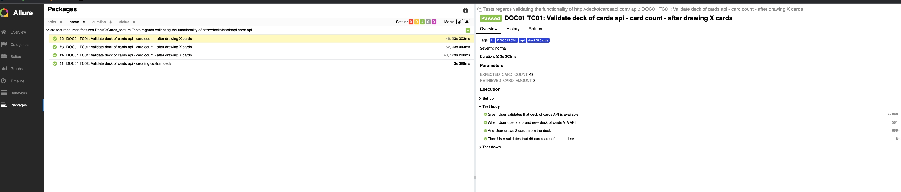

Test automation project for api: 'http://deckofcardsapi.com/'
=======================================

The following tests are automated:
----------------------------------

- STORY: DOC01 - Validate the functionality of http://deckofcardsapi.com/ api.
    - TC01: Validate deck of cards api - card count - after drawing X cards
    - TC02: Validate deck of cards api - creating custom deck
    - TC03: Validate deck of cards api - validate cards presence after drawing (not implemeneted)


Scenario test case can be found here:
```
src/test/resources/features/DeckOfCards.feature
```

Requirements
-------------
- Java
- Maven

Quick start
-------------

After installing all the dependencies the tests can be ran executing command:

- Run - [TestNG](TestNg.xml) - configuration file

By default, tests are executed in parallel mode using "4" threads
§

Report generation
-------------

After tests are finished report can be generated executing command :
```maven
mvn allure:serve
```




Note
---------------
Did not create the last scenario because - I wanted to finish this task in somewhat timely matter, had 
a quick look at it, and it did not look like it would be too difficult to automate. 
Also, an improvement for the whole project could be:
- split the step_definition functionality in class methods
- adding more information to the report on fails 


